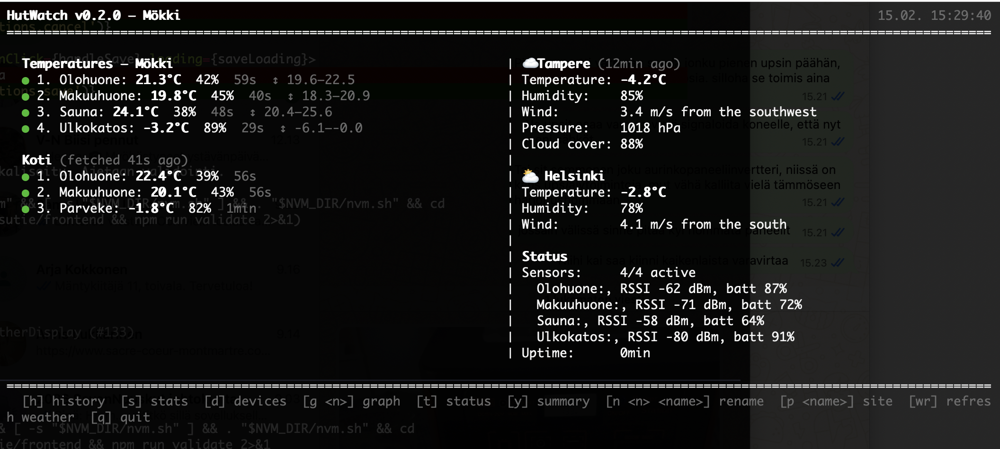

# HutWatch

> **[English](README.md)** | Suomi

BLE-lämpötilaseuranta Telegram-botilla ja terminaalikäyttöliittymällä. Lukee lämpötiladataa RuuviTag- ja Xiaomi LYWSD03MMC -antureista, hakee ulkosään yr.no:sta ja lähettää tiedot Telegramiin tai näyttää ne ASCII-dashboardissa.



## Ominaisuudet

- RuuviTag (Data Format 3/5) tuki
- Xiaomi LYWSD03MMC (ATC/PVVX custom firmware) tuki
- Jatkuva autodiscovery: uudet anturit löytyvät automaattisesti myös kun sensoreita on jo konfiguroitu
- Ulkosää MET Norway API:sta (yr.no), 1h päivitysvälillä
- **Monen paikan seuranta**: sisäänrakennettu API-palvelin ja etäkysely — seuraa useita kohteita (esim. koti + mökki) Tailscalen tai VPN:n yli
- **Kolme käyttöliittymää:**
  - **Telegram-botti**: `/temps`, `/weather`, `/history`, `/stats`, `/graph`, `/menu`
  - **TUI-dashboard**: ASCII-pohjainen terminaalinäkymä (lämpötilat, sää, tilastot, graafit, laitteiden hallinta)
  - **Konsolituloste**: yksinkertainen taulukkotuloste määrävälein tai Enterillä
- **Yhteenvetotila**: vaihdettava 24h min-max -näkymä — tiivis rivinäkymä tai laajennetut tilastot
- SQLite-tietokanta pitkäaikaishistorialle
- 24h muistivälimuisti + 90 päivän tietokantahistoria
- Paikan nimeäminen ja sääpaikan asetus TUI:sta (tallennetaan tietokantaan)
- Kaksikielinen käyttöliittymä: suomi (oletus) ja englanti — asetetaan configista tai `--lang`-lipulla
- Systemd-palvelu

## Vaatimukset

- Python 3.10+
- Bluetooth-adapteri (BLE-tuki)
- Linux (testattu Ubuntu 20.04/22.04) tai macOS

## Asennus

```bash
# Kloonaa repo
git clone https://github.com/trotor/hutwatch.git
cd hutwatch

# Luo virtuaaliympäristö
python3 -m venv venv

# Asenna — valitse toinen:
./venv/bin/pip install -e .              # Ilman Telegramia
./venv/bin/pip install -e ".[telegram]"  # Telegram-botti mukaan

# Kopioi ja muokkaa konfiguraatio
cp config.example.yaml config.yaml
nano config.yaml
```

> **Huom:** Jos päivität olemassaolevaa asennusta jossa Telegram on käytössä,
> varmista että asennat `.[telegram]`-extran. Pelkkä `pip install -e .` ei
> asenna Telegram-pakettia.

## Konfiguraatio

Muokkaa `config.yaml`:

```yaml
# Käyttöliittymän kieli: fi (suomi, oletus) tai en (englanti)
# Voi asettaa myös --lang-lipulla
# language: fi

# Tyhjä lista = vain autodiscovery
# Listatut anturit + autodiscovery: uudet löytyvät silti automaattisesti
sensors: []

# Tai listaa anturit manuaalisesti:
# sensors:
#   - mac: "AA:BB:CC:DD:EE:FF"
#     name: "Ulkona"
#     type: ruuvi
#   - mac: "11:22:33:44:55:66"
#     name: "Sisällä"
#     type: xiaomi

# Telegram-botti (valinnainen — vaatii pip install hutwatch[telegram])
# Ilman Telegramia käytetään konsolitulosteetta tai TUI:ta.
# telegram:
#   token: "YOUR_BOT_TOKEN"
#   chat_id: YOUR_CHAT_ID
#   report_interval: 3600

# Ulkosää yr.no:sta (valinnainen — voi asettaa myös TUI:sta)
# weather:
#   latitude: 60.1699
#   longitude: 24.9384
#   location_name: "Helsinki"

# API-palvelin etäkäyttöä varten (valinnainen)
# Tarjoaa anturidatan JSON-muodossa annetusta portista.
# api_port: 8099

# Etä-HutWatch-instanssit seurattavaksi (valinnainen)
# Hakee anturi- ja säädatan muilta HutWatch API-palvelimilta.
# remote_sites:
#   - name: "Mökki"
#     url: "http://100.64.0.2:8099"
#     poll_interval: 30
```

### Telegram-botin luonti

1. Avaa Telegram ja etsi `@BotFather`
2. Lähetä `/newbot` ja seuraa ohjeita
3. Kopioi token config.yaml-tiedostoon

### Chat ID:n hakeminen

1. Lähetä viesti botillesi Telegramissa
2. Aja:
```bash
./venv/bin/python -c "
import asyncio
from telegram import Bot
bot = Bot('YOUR_TOKEN')
updates = asyncio.run(bot.get_updates())
for u in updates:
    if u.message:
        print(f'chat_id: {u.message.chat.id}')
"
```

## Käyttö

### TUI-dashboard (suositeltu paikalliseen käyttöön)

```bash
./venv/bin/python -m hutwatch -c config.yaml --tui
```

Interaktiivinen ASCII-dashboard jossa:

| Komento | Toiminto |
|---------|----------|
| `h [aika]` | Historia (esim. `h 6`, `h 1d`, `h 7d`) |
| `s [aika]` | Tilastot (esim. `s 1d`, `s 7d`) |
| `g <n> [aika]` | Lämpötilagraafi (esim. `g 1 24h`, `g saa 7d`) |
| `d` | Laitelista |
| `n <n> <nimi>` | Nimeä anturi (esim. `n 1 Olohuone`) |
| `p <nimi>` | Nimeä paikka (esim. `p Mökki`) |
| `w <paikka>` | Aseta sääpaikka (esim. `w Toivala`) |
| `w <lat> <lon>` | Aseta sää koordinaateilla |
| `wr` | Päivitä sää heti |
| `t` | Näytä/piilota status-osio |
| `y` | Vaihda yhteenvetotila (min-max rivissä / laajennetut 24h-tilastot) |
| `r` / Enter | Päivitä / takaisin dashboardiin |
| `q` | Lopeta |

Sääpaikka ja paikan nimi tallentuvat tietokantaan — säilyvät uudelleenkäynnistysten yli.

### Konsolituloste

```bash
# Tulosta 60s välein (ohita Telegram)
./venv/bin/python -m hutwatch -c config.yaml --console 60

# Tulosta Enterillä
./venv/bin/python -m hutwatch -c config.yaml --console

# Oletus (ei Telegramia): tulosta 30s välein
./venv/bin/python -m hutwatch -c config.yaml -v
```

### Telegram-botti

```bash
./venv/bin/python -m hutwatch -c config.yaml -v
```

### Systemd-palvelu

```bash
sudo cp hutwatch.service /etc/systemd/system/
sudo systemctl daemon-reload
sudo systemctl enable --now hutwatch

sudo systemctl status hutwatch
sudo journalctl -u hutwatch -f
```

## Telegram-komennot

### Peruskomennot

| Komento | Kuvaus |
|---------|--------|
| `/menu` | Interaktiivinen valikko napeilla |
| `/temps` | Kaikkien anturien lämpötilat + sää |
| `/weather` | Yksityiskohtainen säätila |
| `/status` | Järjestelmän tila |
| `/help` | Ohje |

### Historia ja tilastot

| Komento | Kuvaus |
|---------|--------|
| `/history` | Lämpötilahistoria (6h oletus) |
| `/history 24h` | 24 tunnin historia |
| `/history 7d` | 7 päivän historia |
| `/stats 1d` | Päivän tilastot (min/max/avg) |
| `/graph 1 24h` | ASCII-graafi anturille 1 |
| `/graph sää 48h` | Sään lämpötilagraafi |

### Laitteiden hallinta

| Komento | Kuvaus |
|---------|--------|
| `/devices` | Listaa laitteet numeroineen |
| `/rename 1 Olohuone` | Nimeä laite 1 uudelleen |
| `/report on/off` | Ajastetut raportit päälle/pois |

## Interaktiivinen valikko

Komento `/menu` tai `/start` avaa interaktiivisen valikon inline-napeilla:

- Lämpötilat ja sää yhdellä napilla
- Historia 1d / 7d / 30d
- Tilastot 1d / 7d / 30d
- Päivitä-nappi jokaisessa näkymässä

## Monen paikan seuranta (etäkohteet)

HutWatch voi seurata useita kohteita yhdistämällä instanssit verkon yli (esim. Tailscale tai VPN). Jokainen kohde ajaa omaa HutWatchia sisäänrakennetulla API-palvelimella, ja keskusinstanssi kyselee dataa kaikilta etäkohteilta.

### Toimintaperiaate

1. **API-palvelin**: Jokainen HutWatch-instanssi voi tarjota anturi- ja säädatansa JSON-muodossa HTTP-rajapinnan kautta (`/api/v1/status`).
2. **Etäkysely**: HutWatch-instanssi voi kysellä yhtä tai useampaa etä-API-palvelinta ja näyttää niiden datan paikallisten anturien rinnalla.

### Esimerkki: koti + mökki

**Mökki** (etäkohde) — ajaa HutWatchia API-palvelin päällä:

```yaml
# config.yaml mökillä
sensors: []
api_port: 8099
```

```bash
./venv/bin/python -m hutwatch -c config.yaml --tui
```

**Koti** (keskuskohde) — kyselee mökin dataa Tailscalen yli:

```yaml
# config.yaml kotona
sensors: []
api_port: 8099

remote_sites:
  - name: "Mökki"
    url: "http://100.64.0.2:8099"   # Mökin Tailscale-IP
    poll_interval: 30
```

TUI-dashboard ja konsolituloste näyttävät etäkohteiden anturit ja sään paikallisten tietojen rinnalla. API-portin voi asettaa myös `--api-port`-lipulla komentorivillä.

## macOS: taustapalvelu ja työpöytäwidget

### Taustaajo launchd:llä

macOS:n natiivi palvelunhallinta. Käynnistyy automaattisesti kirjautumisen yhteydessä ja uudelleenkäynnistyy virheen sattuessa.

1. Luo tiedosto `~/Library/LaunchAgents/com.hutwatch.agent.plist`:

```xml
<?xml version="1.0" encoding="UTF-8"?>
<!DOCTYPE plist PUBLIC "-//Apple//DTD PLIST 1.0//EN"
  "http://www.apple.com/DTDs/PropertyList-1.0.dtd">
<plist version="1.0">
<dict>
    <key>Label</key>
    <string>com.hutwatch.agent</string>
    <key>ProgramArguments</key>
    <array>
        <string>/path/to/hutwatch/venv/bin/python3</string>
        <string>-m</string>
        <string>hutwatch</string>
        <string>-c</string>
        <string>/path/to/hutwatch/config.yaml</string>
    </array>
    <key>WorkingDirectory</key>
    <string>/path/to/hutwatch</string>
    <key>RunAtLoad</key>
    <true/>
    <key>KeepAlive</key>
    <true/>
    <key>StandardOutPath</key>
    <string>/path/to/hutwatch/logs/hutwatch.log</string>
    <key>StandardErrorPath</key>
    <string>/path/to/hutwatch/logs/hutwatch.err</string>
</dict>
</plist>
```

2. Ota käyttöön:

```bash
mkdir -p logs
launchctl load ~/Library/LaunchAgents/com.hutwatch.agent.plist
```

3. Hallinta:

```bash
# Tarkista tila
launchctl list | grep hutwatch

# Pysäytä
launchctl unload ~/Library/LaunchAgents/com.hutwatch.agent.plist

# Käynnistä uudelleen
launchctl unload ~/Library/LaunchAgents/com.hutwatch.agent.plist
launchctl load ~/Library/LaunchAgents/com.hutwatch.agent.plist

# Lokien seuranta
tail -f logs/hutwatch.log
```

### Übersicht-työpöytäwidget

[Übersicht](https://tracesof.net/uebersicht/) on ilmainen macOS-sovellus, joka näyttää HTML/JS-widgettejä työpöydällä.

1. Asenna Übersicht: https://tracesof.net/uebersicht/
2. Kopioi widget:

```bash
cp -r widget/hutwatch.widget "$HOME/Library/Application Support/Übersicht/widgets/"
```

3. Muokkaa polut tiedostossa `index.jsx` (rivit 7-8) vastaamaan omaa asennustasi
4. Widget päivittyy automaattisesti 30 sekunnin välein

Widget-data tuotetaan komennolla:

```bash
./venv/bin/python -m hutwatch.widget_output -d hutwatch.db
```

## Xiaomi-anturin firmware

Xiaomi LYWSD03MMC vaatii custom firmwaren BLE-mainosten lähettämiseen:

- [ATC firmware](https://github.com/atc1441/ATC_MiThermometer)
- [PVVX firmware](https://github.com/pvvx/ATC_MiThermometer)

Flashaus onnistuu selaimella: https://pvvx.github.io/ATC_MiThermometer/TelinkMiFlasher.html

## Lisenssi

MIT
